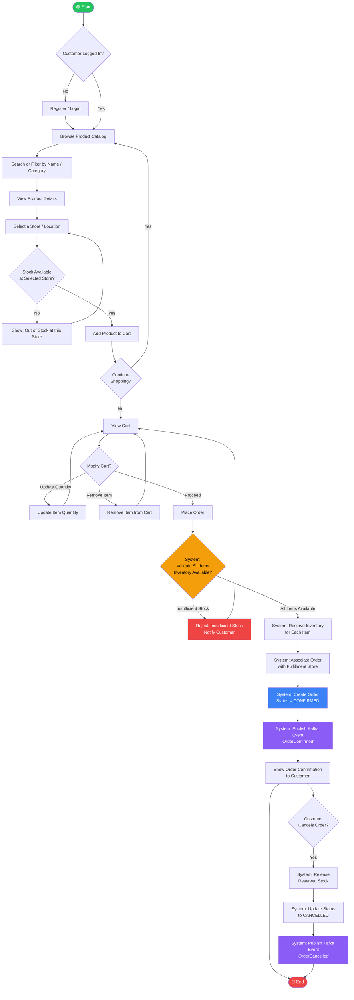
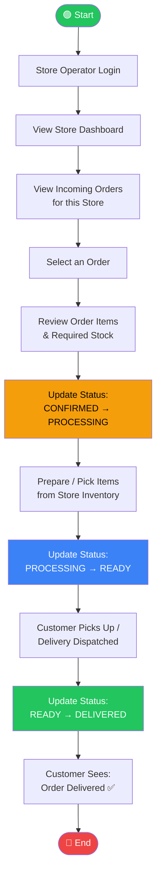
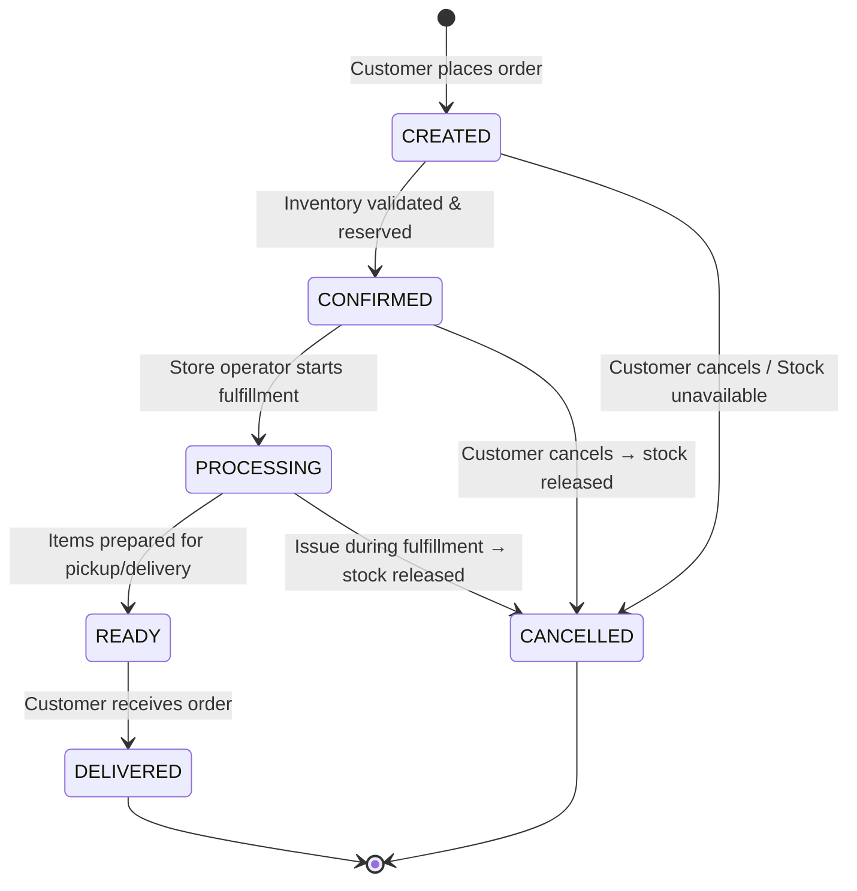
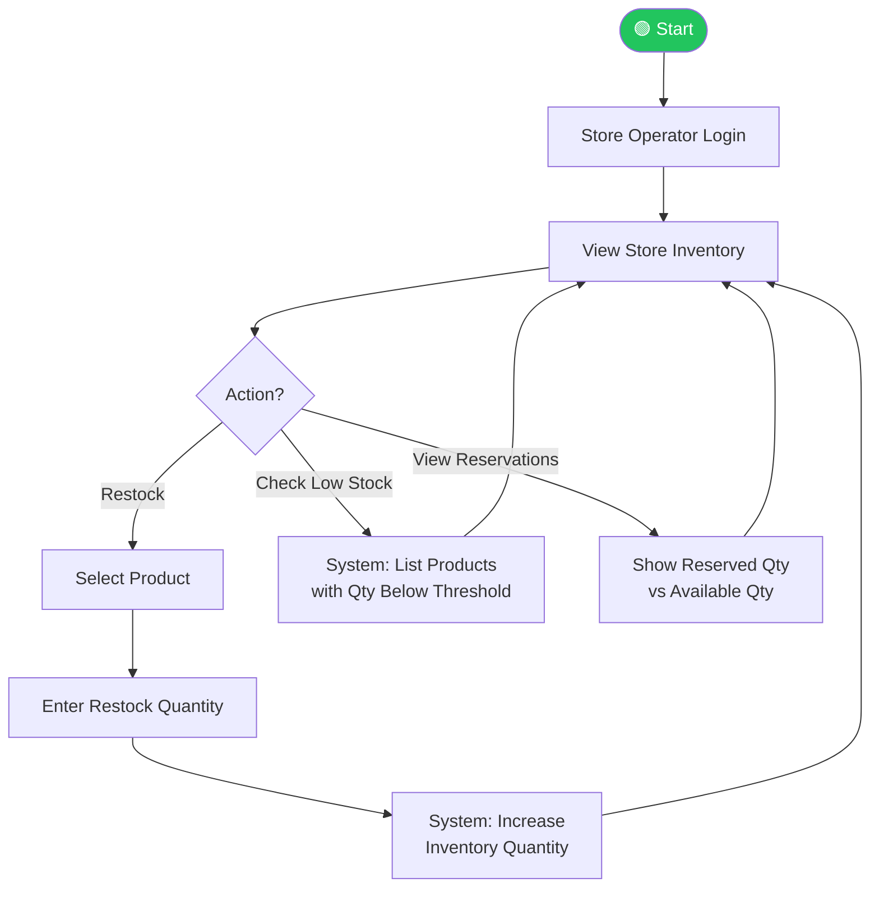

# StoreConnect – Activity Diagrams

> **How to render:** Open this file in VS Code with the "Markdown Preview Mermaid Support" extension, or paste the mermaid block into [mermaid.live](https://mermaid.live).

---

## 1. Customer Order Placement Journey (Primary Flow)

This is the **core business journey** that the CPS must demonstrate end-to-end.

---

## 2. Store Operator – Order Fulfillment Flow

---

## 3. Order Status State Machine

---

## 4. Inventory Management Flow

---

## Flow Summary

| Flow | Actors Involved | Key System Actions |
|------|----------------|-------------------|
| **Order Placement** | Customer, System | Validate inventory → Reserve stock → Create order → Publish Kafka event |
| **Order Fulfillment** | Store Operator, System | CONFIRMED → PROCESSING → READY → DELIVERED |
| **Order Cancellation** | Customer/Operator, System | Release reserved stock → Update status to CANCELLED |
| **Inventory Management** | Store Operator | Restock, view reservations, low-stock alerts |
