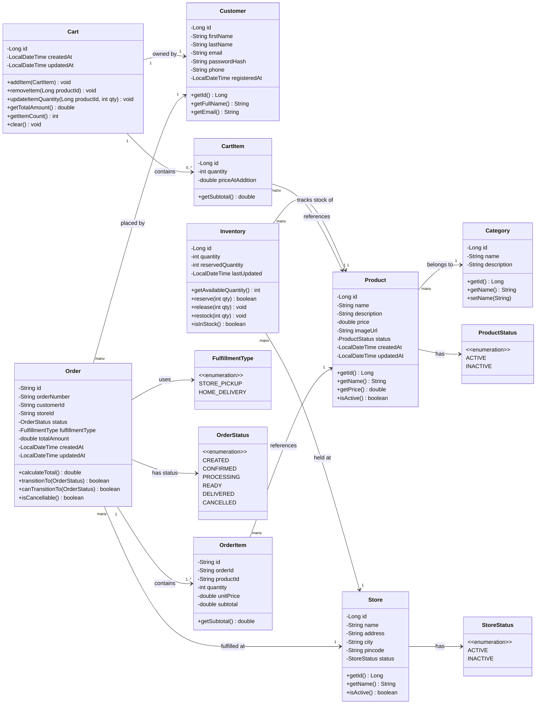

# StoreConnect – Class Diagram

> **How to render:** Open this file in VS Code with the "Markdown Preview Mermaid Support" extension, or paste the mermaid block into [mermaid.live](https://mermaid.live).

---

---

## Entity Descriptions

| Entity | Purpose |
|--------|---------|
| **Product** | Core catalog item with name, price, description and category |
| **Category** | Groups products (e.g., Electronics, Clothing, Groceries) |
| **Store** | Physical retail location represented digitally |
| **Customer** | Registered user who shops on the platform |
| **Inventory** | Tracks quantity and reserved stock of a Product at a specific Store |
| **Cart** | Customer's shopping cart containing CartItems |
| **CartItem** | A line item in the cart (product + quantity + price snapshot) |
| **Order** | A placed order with lifecycle status and fulfillment store |
| **OrderItem** | A line item within an order (product + quantity + price at order time) |

## Key Design Decisions

1. **Price snapshot in CartItem & OrderItem** – Captures the price at the time of cart addition / order placement so that later price changes don't affect existing orders.
2. **Inventory has `reservedQuantity`** – `availableQuantity = quantity - reservedQuantity`. This allows checking availability vs. committed stock.
3. **OrderStatus is an enum with valid transitions** – The `canTransitionTo()` method enforces the state machine (`CREATED → CONFIRMED → PROCESSING → READY → DELIVERED | CANCELLED`).
4. **Cart is 1:1 with Customer** – Each customer has exactly one active cart.
5. **Relational Database Parity** – `Cart` and `CartItem` map directly to `carts` and `cart_items` in the relational schema for cross-device persistence.
