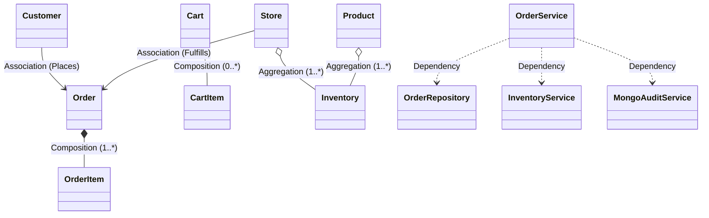

# StoreConnect – Classes, Methods & Object-Oriented Relations Specification

**Project:** StoreConnect – Omnichannel Retail Platform  
**Jira Subtask:** `ST-OO-01: Classes and Its Methods (Relations) Specification Documentation`  
**Package Base:** `com.storeconnect`  

---

## 1. Class Hierarchy & Architectural Layering

```
com.storeconnect
├── domain/                    <-- Core Entities, Enums, State Machine
│   ├── OrderStatus.java       (Enum with State Machine Transition Matrix)
│   ├── FulfillmentType.java   (Enum: STORE_PICKUP, HOME_DELIVERY)
│   ├── PaymentStatus.java     (Enum: PENDING, PAID, FAILED, REFUNDED)
│   ├── Category.java          (Entity)
│   ├── Product.java           (Entity)
│   ├── Store.java             (Entity)
│   ├── Inventory.java         (Entity with atomic business methods)
│   ├── Customer.java          (Entity)
│   ├── Cart.java              (Aggregate: Customer Shopping Basket)
│   ├── CartItem.java          (Value Object: Cart Line Item)
│   ├── Order.java             (Aggregate Root: Placed Order)
│   └── OrderItem.java         (Entity: Snapshot Order Line Item)
├── service/                   <-- Business Logic & Streams
│   ├── CatalogService.java    (Catalog filtering & multi-store stock mapping)
│   ├── InventoryService.java  (Stock checks, reservation, and release logic)
│   └── OrderService.java      (Atomic checkout, state transitions, events)
├── repository/                <-- Data Persistence & JDBC DAOs
│   ├── DatabaseManager.java   (Connection provider with resilient fallback)
│   ├── ProductRepository.java & ProductJdbcDao.java
│   ├── StoreRepository.java & StoreJdbcDao.java
│   ├── InventoryRepository.java & InventoryJdbcDao.java
│   ├── OrderRepository.java & OrderJdbcDao.java
│   └── CustomerJdbcDao.java
└── audit/                     <-- NoSQL Audit Logging
    ├── AuditEvent.java        (Audit Document Model)
    └── MongoAuditService.java (MongoDB event synchronizer with memory queue)
```

---

## 2. Domain Model Classes & Method Signatures

### 2.1 Enum: `OrderStatus`
Enforces the strict order lifecycle state machine.

```java
public enum OrderStatus {
    PENDING, CONFIRMED, PROCESSING, READY_FOR_PICKUP, COMPLETED, CANCELLED;
}
```

| Method Signature | Parameters | Returns | Business Purpose & Logic |
|:---|:---|:---:|:---|
| `nextValidStatuses()` | None | `Set<OrderStatus>` | Abstract method returning allowed outgoing transitions for current state. |
| `canTransitionTo(OrderStatus target)` | `OrderStatus target` | `boolean` | Checks if transition to target state is legally permissible. |
| `validateTransition(OrderStatus target)` | `OrderStatus target` | `void` | Throws `IllegalStateException` if the transition is prohibited. |

**State Transition Matrix:**
- `PENDING` $\rightarrow$ `CONFIRMED`, `CANCELLED`
- `CONFIRMED` $\rightarrow$ `PROCESSING`, `CANCELLED`
- `PROCESSING` $\rightarrow$ `READY_FOR_PICKUP`, `CANCELLED`
- `READY_FOR_PICKUP` $\rightarrow$ `COMPLETED`
- `COMPLETED` $\rightarrow$ `[]` (Terminal State)
- `CANCELLED` $\rightarrow$ `[]` (Terminal State)

---

### 2.2 Class: `Inventory`
Encapsulates store-level stock calculations and validation invariants.

**Fields:**
- `private String id`
- `private String storeId`
- `private String productId`
- `private int quantityAvailable`
- `private int quantityReserved`
- `private int reorderThreshold`
- `private LocalDateTime updatedAt`

| Method Signature | Parameters | Returns | Description & Invariants |
|:---|:---|:---:|:---|
| `hasSufficientStock(int requestedQty)` | `int requestedQty` | `boolean` | Returns `true` if `requestedQty > 0` and `quantityAvailable >= requestedQty`. |
| `reserve(int quantity)` | `int quantity` | `void` | Atomically subtracts `quantity` from available and adds to reserved. Throws `IllegalArgumentException` if insufficient stock. |
| `release(int quantity)` | `int quantity` | `void` | Decrements reserved and restores available (e.g., on order cancellation). |
| `fulfill(int quantity)` | `int quantity` | `void` | Decrements reserved stock upon customer pickup/dispatch completion. |
| `restock(int quantity)` | `int quantity` | `void` | Increments `quantityAvailable` when store receives replenishments. |
| `isLowStock()` | None | `boolean` | Returns `true` if `quantityAvailable <= reorderThreshold`. |

---

### 2.3 Class: `Cart` and `CartItem`
Models the pre-checkout customer basket in memory.

**`Cart` Fields:**
- `private String customerId`
- `private String selectedStoreId`
- `private final Map<String, CartItem> items`

| Method Signature | Parameters | Returns | Description & Logic |
|:---|:---|:---:|:---|
| `addItem(Product p, int qty)` | `Product product, int quantity` | `void` | Adds item or increments existing quantity in cart map. |
| `updateQuantity(String prodId, int newQty)` | `String productId, int newQuantity` | `void` | Updates quantity. If `newQty <= 0`, removes item from cart. |
| `removeItem(String prodId)` | `String productId` | `void` | Removes product entry from cart map. |
| `calculateTotal()` | None | `BigDecimal` | Uses Java Streams to map `CartItem::getSubtotal` and reduce to total sum. |
| `getTotalItemCount()` | None | `int` | Uses `items.values().stream().mapToInt(CartItem::getQuantity).sum()`. |
| `clear()` | None | `void` | Clears all items after successful checkout. |

---

### 2.4 Class: `Order` (Aggregate Root) and `OrderItem`
Represents confirmed customer commitments tied to a physical store location.

**`Order` Fields:**
- `private String id`
- `private String orderNumber`
- `private String customerId`
- `private String storeId`
- `private OrderStatus status`
- `private FulfillmentType fulfillmentType`
- `private BigDecimal totalAmount`
- `private LocalDateTime createdAt, updatedAt`
- `private final List<OrderItem> items`

| Method Signature | Parameters | Returns | Description & Logic |
|:---|:---|:---:|:---|
| `addItem(OrderItem item)` | `OrderItem item` | `void` | Appends item, associates `orderId`, and recalculates total. |
| `calculateTotal()` | None | `void` | Streams line items and sets `totalAmount = sum(item.subtotal)`. |
| `transitionTo(OrderStatus next)` | `OrderStatus nextStatus` | `void` | Delegates to `this.status.validateTransition(next)`. Updates `status` and `updatedAt`. |
| `setItems(List<OrderItem> list)` | `List<OrderItem> list` | `void` | Replaces items collection and recalculates `totalAmount`. |

---

## 3. Business Service Layer & Method Signatures

### 3.1 Class: `CatalogService`
Orchestrates product discovery and store inventory cross-referencing.

| Method Signature | Parameters | Returns | Description & Logic |
|:---|:---|:---:|:---|
| `getAllActiveProducts()` | None | `List<Product>` | Streams all products and filters by `isActive() == true`. |
| `searchProducts(String kw, String catId, BigDecimal maxPrice)` | `String keyword, String categoryId, BigDecimal maxPrice` | `List<Product>` | Multi-criteria search using stream filter predicates (keyword matching name/desc/SKU, category ID matching, max price ceiling). |
| `getStoreAvailabilityMap(String prodId)` | `String productId` | `Map<Store, Integer>` | Queries each store and maps `Store` $\rightarrow$ Available Stock count for the given product. |

---

### 3.2 Class: `InventoryService`
Manages inventory queries and atomic updates.

| Method Signature | Parameters | Returns | Description & Logic |
|:---|:---|:---:|:---|
| `isAvailable(String storeId, String prodId, int qty)` | `String storeId, String productId, int requestedQuantity` | `boolean` | Verifies if store has sufficient stock for requested quantity. |
| `reserveStock(String storeId, String prodId, int qty)` | `String storeId, String productId, int quantity` | `boolean` | Executes atomic database reservation. |
| `releaseStock(String storeId, String prodId, int qty)` | `String storeId, String productId, int quantity` | `boolean` | Restores reserved inventory back to available. |
| `getLowStockAlerts(String storeId)` | `String storeId` | `List<Inventory>` | Uses Streams to filter inventory records where `quantityAvailable <= reorderThreshold`. |

---

### 3.3 Class: `OrderService`
Coordinates checkout transactions, state transitions, and audit trail events.

| Method Signature | Parameters | Returns | Description & Logic |
|:---|:---|:---:|:---|
| `checkout(Cart cart, FulfillmentType type)` | `Cart cart, FulfillmentType fulfillmentType` | `Order` | 1. Validates store stock for all items.<br/>2. Atomically reserves stock in DB.<br/>3. Persists Order and OrderItems in relational DB.<br/>4. Logs `ORDER_PLACED` event to MongoDB.<br/>5. Clears shopping cart. |
| `updateStatus(String orderId, OrderStatus next, String actor)` | `String orderId, OrderStatus targetStatus, String operatorId` | `Order` | 1. Validates state transition via state machine.<br/>2. If `CANCELLED`, automatically releases reserved stock.<br/>3. If `COMPLETED`, marks reserved stock fulfilled.<br/>4. Updates DB and logs `ORDER_STATUS_CHANGED` in MongoDB. |

---

## 4. Object-Oriented Relationships & Design Patterns

### 4.1 UML Relationship Classification



1. **Composition (`*--`):**
   - `Order` $\rightarrow$ `OrderItem`: An `OrderItem` cannot exist without a parent `Order`. Deleting an order cascades and deletes its line items.
   - `Cart` $\rightarrow$ `CartItem`: Items are strictly lifecycle-bound to the cart instance.
2. **Aggregation (`o--`):**
   - `Store` $\rightarrow$ `Inventory`: A Store has inventory, but physical stores exist independently of stock records.
   - `Product` $\rightarrow$ `Inventory`: Products exist in the catalog even if inventory has 0 records.
3. **Association (`-->`):**
   - `Customer` $\rightarrow$ `Order`: A Customer places Orders; Orders maintain a reference to the Customer ID.
   - `Store` $\rightarrow$ `Order`: An Order references a fulfilling Store.
4. **Dependency (`..>`):**
   - `OrderService` depends on `OrderRepository`, `InventoryService`, and `MongoAuditService`.

### 4.2 Design Patterns Implemented
- **State Pattern (Enum-Driven):** `OrderStatus` encapsulates state-specific transition rules and validation within its enum hierarchy.
- **Aggregate Root Pattern (DDD):** `Order` controls all access to `OrderItem` instances and maintains consistency of total amounts.
- **Repository / DAO Pattern:** `ProductJdbcDao`, `StoreJdbcDao`, `InventoryJdbcDao`, and `OrderJdbcDao` decouple business logic from raw SQL execution.
