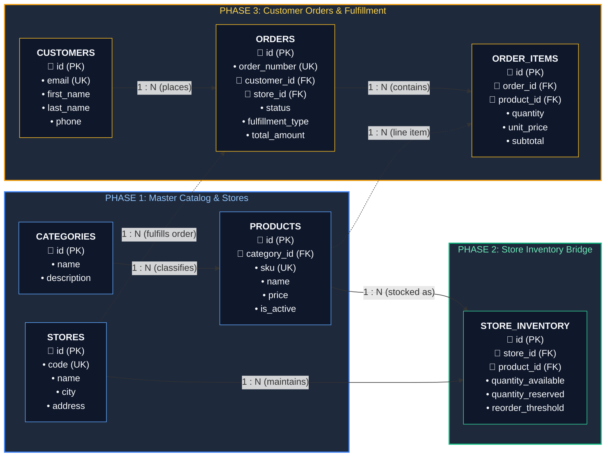
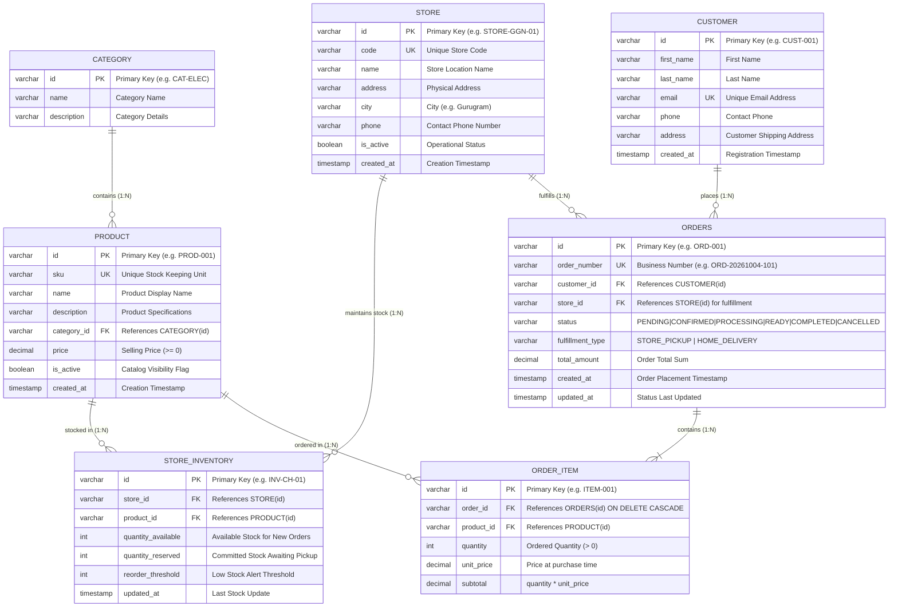

# StoreConnect – Entity Relationship Diagram (ERD)

**Project:** StoreConnect – Omnichannel Retail Platform  
**Architecture Theme:** Relational Database Model (PostgreSQL / ANSI SQL)  
**Schema DDL:** [`src/main/resources/schema.sql`](file:///d:/PS_CPS_Project/src/main/resources/schema.sql)  
**Seed Data:** [`src/main/resources/seed_data.sql`](file:///d:/PS_CPS_Project/src/main/resources/seed_data.sql)  

---

## 1. Visual Flow-Based ER Diagram (Left-to-Right Architecture)

This diagram organizes the relational database schema into three progressive operational phases, making the data lifecycle and foreign key relationships immediately clear:



---

## 2. Standard Crow's Foot Entity Relationship Diagram (ERD)



---

## 3. End-to-End Business Flow Walkthrough

The schema is organized to support a seamless, 4-step omnichannel lifecycle:

```
[1. Master Setup]          [2. Stock Allocation]         [3. Customer Order]         [4. Order Fulfillment]
CATEGORY ──► PRODUCT ──┐                                                              
                       ├──► STORE_INVENTORY ◄── STORE ◄─── CUSTOMER ──► ORDERS ──► ORDER_ITEMS
                       │                         │                         ▲              │
                       │                         └─────────────────────────┘              ▼
                       └─────────────────────────────────────────────────────────────► (Snapshot Price)
```

1. **Step 1: Catalog & Location Setup (Phase 1):**
   - Products are categorized under `CATEGORIES`.
   - Physical retail stores are defined in `STORES` with city, address, and contact details.

2. **Step 2: Omnichannel Inventory Mapping (Phase 2):**
   - Stock is decoupled from `PRODUCT` and mapped through `STORE_INVENTORY` using composite uniqueness on `(store_id, product_id)`.
   - Each physical store tracks its own `quantity_available` (for new sales) and `quantity_reserved` (for confirmed orders).

3. **Step 3: Customer Checkout & Atomic Stock Lock (Phase 3):**
   - A `CUSTOMER` selects a fulfillment store and checks out.
   - An `ORDERS` record is created with `store_id` (fulfillment store) and `customer_id`.
   - Stock in `STORE_INVENTORY` is atomically decremented: `quantity_available -= qty`, `quantity_reserved += qty`.

4. **Step 4: Order Line Items & Fulfillment (Phase 3):**
   - `ORDER_ITEMS` snapshot the exact `unit_price` at the moment of order placement.
   - Store operators at `STORE` fulfill the order through the state machine:
     `CONFIRMED` $\rightarrow$ `PROCESSING` (picking) $\rightarrow$ `READY_FOR_PICKUP` (packed) $\rightarrow$ `COMPLETED` (collected).
   - If cancelled, reserved stock is automatically returned to `quantity_available`.

---

## 4. Complete Relational Data Dictionary

| Table | Column | Type | Constraints | Description |
|:---|:---|:---|:---|:---|
| **`categories`** | `id` | VARCHAR(50) | PRIMARY KEY | Unique category identifier (e.g., `CAT-ELEC`) |
| | `name` | VARCHAR(100) | NOT NULL | Category display name |
| | `description` | VARCHAR(255) | | Category description |
| **`stores`** | `id` | VARCHAR(50) | PRIMARY KEY | Unique store identifier (e.g., `STORE-GGN-01`) |
| | `code` | VARCHAR(20) | UNIQUE, NOT NULL | Store short code (e.g., `STR-CH-01`) |
| | `name` | VARCHAR(150) | NOT NULL | Location name (e.g., `StoreConnect CyberHub`) |
| | `address` | VARCHAR(255) | NOT NULL | Street address |
| | `city` | VARCHAR(100) | NOT NULL | City location (e.g., `Gurugram`, `New Delhi`) |
| | `phone` | VARCHAR(20) | | Store phone number |
| | `is_active` | BOOLEAN | DEFAULT TRUE | Operating status |
| **`products`** | `id` | VARCHAR(50) | PRIMARY KEY | Unique product ID (e.g., `PROD-001`) |
| | `sku` | VARCHAR(50) | UNIQUE, NOT NULL | Stock Keeping Unit (e.g., `SKU-SNY-WH1000`) |
| | `name` | VARCHAR(200) | NOT NULL | Product title |
| | `description` | TEXT | | Detailed product description |
| | `category_id` | VARCHAR(50) | FK $\rightarrow$ `categories(id)` | Foreign key reference |
| | `price` | DECIMAL(10,2) | NOT NULL, CHECK $\ge 0$ | Current catalog selling price |
| | `is_active` | BOOLEAN | DEFAULT TRUE | Catalog visibility toggle |
| **`store_inventory`**| `id` | VARCHAR(50) | PRIMARY KEY | Unique inventory record ID |
| | `store_id` | VARCHAR(50) | FK $\rightarrow$ `stores(id)` | Target store location |
| | `product_id` | VARCHAR(50) | FK $\rightarrow$ `products(id)` | Target catalog product |
| | `quantity_available`| INT | NOT NULL, CHECK $\ge 0$ | Stock available for customer orders |
| | `quantity_reserved` | INT | NOT NULL, CHECK $\ge 0$ | Stock reserved for confirmed orders |
| | `reorder_threshold` | INT | DEFAULT 5 | Low stock trigger count |
| | *Constraint* | `uq_store_product` | UNIQUE(`store_id`, `product_id`) | Ensures 1 row per product per store |
| **`customers`** | `id` | VARCHAR(50) | PRIMARY KEY | Customer identifier (e.g., `CUST-001`) |
| | `first_name` | VARCHAR(100) | NOT NULL | Customer first name |
| | `last_name` | VARCHAR(100) | NOT NULL | Customer last name |
| | `email` | VARCHAR(150) | UNIQUE, NOT NULL | Account email address |
| | `phone` | VARCHAR(20) | | Contact number |
| | `address` | VARCHAR(255) | | Delivery address |
| **`orders`** | `id` | VARCHAR(50) | PRIMARY KEY | Order ID (e.g., `ORD-E1FDDA7A`) |
| | `order_number`| VARCHAR(50) | UNIQUE, NOT NULL | User-friendly number (`ORD-20261004-9446`) |
| | `customer_id` | VARCHAR(50) | FK $\rightarrow$ `customers(id)` | Placing customer |
| | `store_id` | VARCHAR(50) | FK $\rightarrow$ `stores(id)` | Fulfilling physical store |
| | `status` | VARCHAR(30) | NOT NULL | Lifecycle state (`PENDING` $\rightarrow$ `COMPLETED`) |
| | `fulfillment_type`| VARCHAR(30)| NOT NULL | `STORE_PICKUP` or `HOME_DELIVERY` |
| | `total_amount`| DECIMAL(10,2) | NOT NULL, CHECK $\ge 0$ | Sum of order items |
| **`order_items`** | `id` | VARCHAR(50) | PRIMARY KEY | Order item identifier |
| | `order_id` | VARCHAR(50) | FK $\rightarrow$ `orders(id)` | Parent order (ON DELETE CASCADE) |
| | `product_id` | VARCHAR(50) | FK $\rightarrow$ `products(id)` | Purchased product |
| | `quantity` | INT | NOT NULL, CHECK $> 0$ | Quantity ordered |
| | `unit_price` | DECIMAL(10,2) | NOT NULL, CHECK $\ge 0$ | Snapshot price at time of purchase |
| | `subtotal` | DECIMAL(10,2) | NOT NULL, CHECK $\ge 0$ | `quantity * unit_price` |

---

## 5. Secondary NoSQL Audit Log (MongoDB)

For compliance and auditability, high-frequency operational events are logged to MongoDB (`audit_events` collection) without burdening relational transactional tables:

```json
{
  "eventId": "EVT-9A4B2C1D",
  "eventType": "ORDER_STATUS_CHANGED",
  "entityType": "Order",
  "entityId": "ORD-20261004-9446",
  "actor": "OPERATOR-CH-01",
  "details": {
    "previousStatus": "PROCESSING",
    "newStatus": "READY_FOR_PICKUP"
  },
  "timestamp": "2026-10-04T12:06:15.123Z"
}
```
