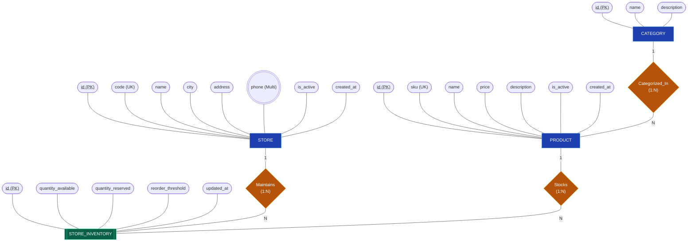
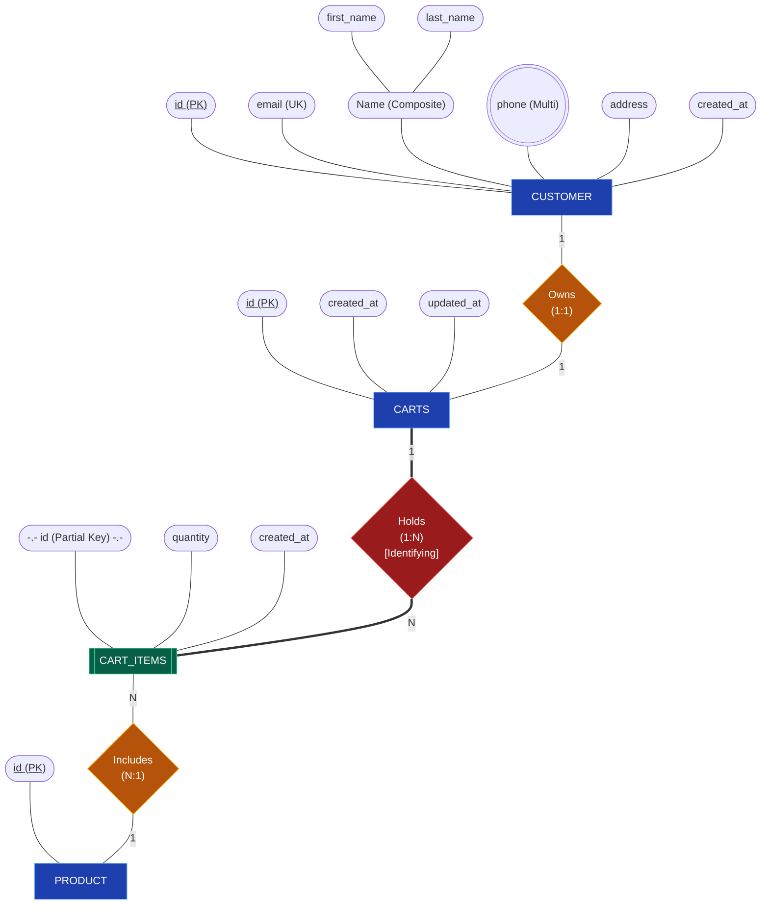
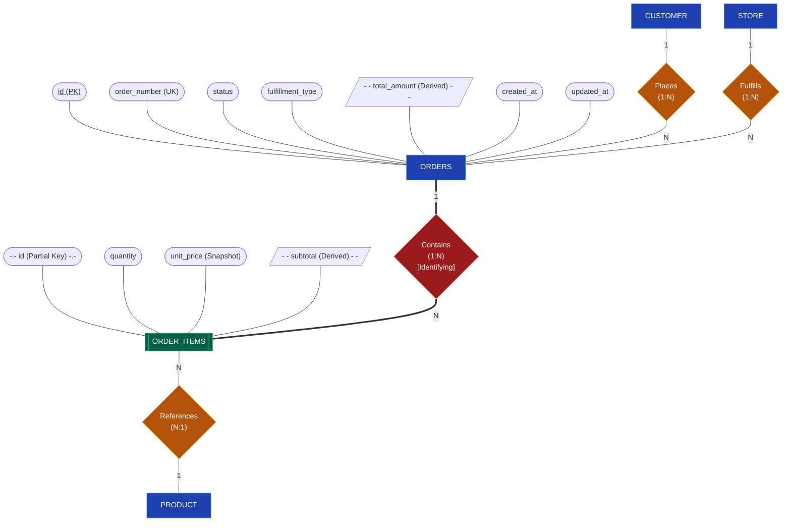

# StoreConnect – Traditional Entity-Relationship (ER) Diagram
> **Reference Standard:** Peter Chen ER Model ([GeeksforGeeks DBMS: Introduction of ER Model](https://www.geeksforgeeks.org/dbms/introduction-of-er-model/))  
> **Target Tools:** Conceptual Documentation | Visual Mermaid | SQL Server Management Studio (SSMS)  
> **Database DDL:** [`docs/storeconnect_ssms_setup.sql`](file:///d:/PS_CPS_Project/docs/storeconnect_ssms_setup.sql) & [`src/main/resources/schema.sql`](file:///d:/PS_CPS_Project/src/main/resources/schema.sql)

---

## 1. Traditional ER Model Fundamentals (GeeksforGeeks Standard)

In academic DBMS theory (Peter Chen Notation, 1976), an ER diagram models the conceptual schema using strict geometric shapes:

| Geometric Symbol | Component Type | Definition & Purpose | StoreConnect Examples |
|:---|:---|:---|:---|
| ▭ **Rectangle** | **Strong Entity** | Independent object with its own primary key | `CUSTOMER`, `STORE`, `CATEGORY`, `PRODUCT`, `ORDERS`, `CARTS` |
| ⧉ **Double Rectangle** | **Weak Entity** | Existence depends on an owner entity; lacks independent primary key | `ORDER_ITEMS` (depends on `ORDERS`), `CART_ITEMS` (depends on `CARTS`), `STORE_INVENTORY` |
| ⬡ **Diamond (Rhombus)** | **Relationship Set** | Association connecting two or more entities *(Never a hexagon!)* | `PLACES`, `CATEGORIZED_IN`, `OWNS`, `FULFILLS`, `CONTAINS`, `HOLDS` |
| ⬭ **Ellipse / Oval** | **Simple Attribute** | Individual property describing an entity | `name`, `price`, `city`, `status`, `sku` |
| ⬭ **Underlined Text** | **Key Attribute** | Unique identifier / Primary Key | `<u>id</u>`, `<u>sku</u>`, `<u>order_number</u>`, `<u>email</u>` |
| ⬭⬭ **Double Ellipse** | **Multivalued Attribute** | Attribute that can hold multiple values | `((phone))` (contact numbers) |
| ◌ **Dashed Ellipse** | **Derived Attribute** | Dynamically calculated value | `total_amount` (sum of items), `subtotal` (`qty * price`) |
| 🌿 **Branching Ovals** | **Composite Attribute** | Divisible into sub-attributes | `Name` $\rightarrow$ (`first_name`, `last_name`), `Address` $\rightarrow$ (`street`, `city`) |
| ══ **Double Line** | **Total Participation** | Every instance must participate in the relationship | Every `ORDER_ITEM` must belong to an `ORDER`; every `PRODUCT` has a `CATEGORY` |
| ── **Single Line** | **Partial Participation** | Some instances might not participate | A `CUSTOMER` can exist without having placed an `ORDER` |

---

## 2. Complete Attribute Inventory (All 9 Entities)

Every single attribute across all 9 entities is accounted for below with its exact classification:

| Entity Name | Attribute Name | Attribute Classification | GfG Notation / Description |
|:---|:---|:---|:---|
| **`CATEGORY`** | `id` | **Key Attribute** | ⬭ `<u>id (PK)</u>` |
| | `name` | Simple Attribute | ⬭ `name` (Department name) |
| | `description` | Simple Attribute | ⬭ `description` |
| **`PRODUCT`** | `id` | **Key Attribute** | ⬭ `<u>id (PK)</u>` |
| | `sku` | Candidate Key | ⬭ `sku (UK)` |
| | `name` | Simple Attribute | ⬭ `name` |
| | `price` | Simple Attribute | ⬭ `price` |
| | `description` | Simple Attribute | ⬭ `description` |
| | `is_active` | Simple Attribute | ⬭ `is_active` |
| | `created_at` | Simple Attribute | ⬭ `created_at` |
| **`STORE`** | `id` | **Key Attribute** | ⬭ `<u>id (PK)</u>` |
| | `code` | Candidate Key | ⬭ `code (UK)` |
| | `name` | Simple Attribute | ⬭ `name` |
| | `city` | Simple Attribute | ⬭ `city` |
| | `address` | Simple Attribute | ⬭ `address` |
| | `phone` | **Multivalued Attribute** | ⬭⬭ `((phone))` |
| | `is_active` | Simple Attribute | ⬭ `is_active` |
| | `created_at` | Simple Attribute | ⬭ `created_at` |
| **`STORE_INVENTORY`** | `id` | **Key Attribute** | ⬭ `<u>id (PK)</u>` |
| *(Associative Entity)* | `quantity_available` | Simple Attribute | ⬭ `quantity_available` |
| | `quantity_reserved` | Simple Attribute | ⬭ `quantity_reserved` |
| | `reorder_threshold` | Simple Attribute | ⬭ `reorder_threshold` |
| | `updated_at` | Simple Attribute | ⬭ `updated_at` |
| **`CUSTOMER`** | `id` | **Key Attribute** | ⬭ `<u>id (PK)</u>` |
| | `email` | Candidate Key | ⬭ `email (UK)` |
| | `name` | **Composite Attribute** | 🌿 Branches into `first_name` and `last_name` |
| | `phone` | **Multivalued Attribute** | ⬭⬭ `((phone))` |
| | `address` | Simple / Composite | ⬭ `address` |
| | `created_at` | Simple Attribute | ⬭ `created_at` |
| **`CARTS`** | `id` | **Key Attribute** | ⬭ `<u>id (PK)</u>` |
| | `created_at` | Simple Attribute | ⬭ `created_at` |
| | `updated_at` | Simple Attribute | ⬭ `updated_at` |
| **`CART_ITEMS`** | `id` | **Partial Key** | ⬭ `-.- id (Partial Key) -.-` |
| *(Weak Entity)* | `quantity` | Simple Attribute | ⬭ `quantity` |
| | `created_at` | Simple Attribute | ⬭ `created_at` |
| **`ORDERS`** | `id` | **Key Attribute** | ⬭ `<u>id (PK)</u>` |
| | `order_number` | Candidate Key | ⬭ `order_number (UK)` |
| | `status` | Simple Attribute | ⬭ `status` |
| | `fulfillment_type` | Simple Attribute | ⬭ `fulfillment_type` |
| | `total_amount` | **Derived Attribute** | ◌ `- - total_amount (Derived) - -` |
| | `created_at` | Simple Attribute | ⬭ `created_at` |
| | `updated_at` | Simple Attribute | ⬭ `updated_at` |
| **`ORDER_ITEMS`** | `id` | **Partial Key** | ⬭ `-.- id (Partial Key) -.-` |
| *(Weak Entity)* | `quantity` | Simple Attribute | ⬭ `quantity` |
| | `unit_price` | Simple Attribute | ⬭ `unit_price (Snapshot)` |
| | `subtotal` | **Derived Attribute** | ◌ `- - subtotal (Derived) - -` |

---

## 3. Visual Traditional ER Diagrams (Peter Chen Standard)

### 3.1 Global Conceptual ER Backbone (Pure Entities & Diamonds)
This clean schema view shows all 9 Entities (**Rectangles**) and 10 Relationships (**4-Sided Diamonds**, zero hexagons) with exact cardinalities (`1:1`, `1:N`, `M:N`) and participation constraints:

```mermaid
flowchart TD
    %% ─────────────────────────────────────────────────────────────
    %% ENTITY SETS (Rectangles & Double Rectangles)
    %% ─────────────────────────────────────────────────────────────
    CAT["CATEGORY"]
    PROD["PRODUCT"]
    STR["STORE"]
    INV[["STORE_INVENTORY\n(Associative Entity)"]]
    CUST["CUSTOMER"]
    CART["CARTS"]
    CITEM[["CART_ITEMS\n(Weak Entity)"]]
    ORD["ORDERS"]
    OITEM[["ORDER_ITEMS\n(Weak Entity)"]]

    %% ─────────────────────────────────────────────────────────────
    %% RELATIONSHIPS (All Strict 4-Sided Diamonds - No Hexagons)
    %% ─────────────────────────────────────────────────────────────
    R_CAT_PROD{"Categorized_In\n(1:N)"}
    R_STR_INV{"Maintains\n(1:N)"}
    R_PROD_INV{"Stocks\n(1:N)"}
    R_CUST_CART{"Owns\n(1:1)"}
    R_CART_STR{"Selects_Store\n(N:1)"}
    R_CART_ITEM{"Holds\n(1:N)\n[Identifying]"}
    R_ITEM_PROD{"Includes\n(N:1)"}
    R_CUST_ORD{"Places\n(1:N)"}
    R_STR_ORD{"Fulfills\n(1:N)"}
    R_ORD_ITEM{"Contains\n(1:N)\n[Identifying]"}
    R_OITEM_PROD{"References\n(N:1)"}

    %% ─────────────────────────────────────────────────────────────
    %% CONNECTIONS WITH PARTICIPATION AND CARDINALITIES
    %% ─────────────────────────────────────────────────────────────
    CAT ---|"1"| R_CAT_PROD
    R_CAT_PROD ===|"N (Total)"| PROD

    STR ---|"1"| R_STR_INV
    R_STR_INV ===|"N (Total)"| INV

    PROD ---|"1"| R_PROD_INV
    R_PROD_INV ===|"N (Total)"| INV

    CUST ---|"1"| R_CUST_CART
    R_CUST_CART ===|"1 (Total)"| CART

    CART ---|"N"| R_CART_STR
    R_CART_STR ---|"1"| STR

    CART ===|"1 (Total)"| R_CART_ITEM
    R_CART_ITEM ===|"N (Total)"| CITEM

    CITEM ---|"N"| R_ITEM_PROD
    R_ITEM_PROD ---|"1"| PROD

    CUST ---|"1"| R_CUST_ORD
    R_CUST_ORD ===|"N (Total)"| ORD

    STR ---|"1"| R_STR_ORD
    R_STR_ORD ===|"N (Total)"| ORD

    ORD ===|"1 (Total)"| R_ORD_ITEM
    R_ORD_ITEM ===|"N (Total)"| OITEM

    OITEM ---|"N"| R_OITEM_PROD
    R_OITEM_PROD ---|"1"| PROD

    %% Styling
    style CAT fill:#1e40af,stroke:#60a5fa,stroke-width:2px,color:#ffffff
    style PROD fill:#1e40af,stroke:#60a5fa,stroke-width:2px,color:#ffffff
    style STR fill:#1e40af,stroke:#60a5fa,stroke-width:2px,color:#ffffff
    style CUST fill:#1e40af,stroke:#60a5fa,stroke-width:2px,color:#ffffff
    style CART fill:#1e40af,stroke:#60a5fa,stroke-width:2px,color:#ffffff
    style ORD fill:#1e40af,stroke:#60a5fa,stroke-width:2px,color:#ffffff

    style INV fill:#065f46,stroke:#34d399,stroke-width:3px,color:#ffffff
    style CITEM fill:#065f46,stroke:#34d399,stroke-width:3px,color:#ffffff
    style OITEM fill:#065f46,stroke:#34d399,stroke-width:3px,color:#ffffff

    style R_CAT_PROD fill:#b45309,stroke:#fbbf24,color:#ffffff
    style R_STR_INV fill:#b45309,stroke:#fbbf24,color:#ffffff
    style R_PROD_INV fill:#b45309,stroke:#fbbf24,color:#ffffff
    style R_CUST_CART fill:#b45309,stroke:#fbbf24,color:#ffffff
    style R_CART_STR fill:#b45309,stroke:#fbbf24,color:#ffffff
    style R_ITEM_PROD fill:#b45309,stroke:#fbbf24,color:#ffffff
    style R_CUST_ORD fill:#b45309,stroke:#fbbf24,color:#ffffff
    style R_STR_ORD fill:#b45309,stroke:#fbbf24,color:#ffffff
    style R_OITEM_PROD fill:#b45309,stroke:#fbbf24,color:#ffffff

    style R_CART_ITEM fill:#991b1b,stroke:#f87171,stroke-width:2px,color:#ffffff
    style R_ORD_ITEM fill:#991b1b,stroke:#f87171,stroke-width:2px,color:#ffffff
```



---

### 3.2 Detailed Subsystem Diagrams (Every Attribute Clearly Displayed)

To ensure **100% attribute visibility without overlapping or cutoffs**, each functional subsystem is mapped below with all its oval attributes:

#### Subsystem A: Master Catalog, Stores & Inventory (All Attributes Visible)



---

#### Subsystem B: Customer & Active Shopping Cart (All Attributes Visible)



---

#### Subsystem C: Customer Orders, Items & Store Fulfillment (All Attributes Visible)



---

## 4. Text / ASCII Architecture Map

```
                  ┌───────────────┐
                  │   CATEGORY    │───(id, name, description)
                  └───────┬───────┘
                          │ (1)
                  ◇ <Categorized_In>
                          │ (N)
                  ┌───────┴───────┐
                  │    PRODUCT    │───(id, sku, name, price, description, is_active, created_at)
                  └───┬───────┬───┘
                      │ (1)   │ (1)
          ◇ <Stocks>  │       │
                      │       │
┌──────────────┐      │       │
│    STORE     │      │       │───(id, code, name, city, address, ((phone)), is_active, created_at)
└───┬──────┬───┘      │       │
    │ (1)  │ (1)      │ (N)   │ (1)
    │      │    ┌─────┴───────┴───────┐
    │      └───▶│   STORE_INVENTORY   │───(id, qty_avail, qty_resv, threshold, updated_at)
    │  <Maintains>└───────────────────┘
    │
    │ (1)
◇ <Fulfills>
    │
    │ (N)
┌───┴──────────┐       ◇ <Owns>      ┌────────────────┐
│    ORDERS    │◀───┐      (1:1)     │     CARTS      │───(id, created_at, updated_at)
└───┬──────────┘    │                └───┬────────────┘
    │ (1)           │ (N)                │ (1)
◆ <Contains>    ◇ <Places>           ◆ <Holds>
    │ (N)           │ (1)                │ (N)
┌───┴──────────┐┌───┴──────────┐     ┌───┴────────────┐
│  ORDER_ITEMS ││   CUSTOMER   │     │   CART_ITEMS   │───(id, quantity, created_at)
└───┬──────────┘└──────────────┘     └───┬────────────┘
    │ (N)       │                        │ (N)
    │           └──(id, email, Name->(first, last), ((phone)), address, created_at)
    │
    └──(id, quantity, unit_price, - -subtotal- -)
```

---

## 5. Summary of Why the Previous Rendering Had Errors

1. **Why Hexagons Appeared:**
   * In Mermaid flowchart syntax, double curly braces `{{ text }}` renders a **6-sided hexagon**.
   * In standard DBMS (Peter Chen / GeeksforGeeks), a hexagon is **never** used in an ER diagram! All relationships are **4-sided diamonds** (`{ text }`).
   * We replaced all instances with strict single curly braces `{ text }` and distinct identifying relationship styling.

2. **Why Attributes Were Not Visible:**
   * Putting 9 entities and 45+ attributes in a single graph caused Mermaid's auto-layout algorithm to overlap and collapse attribute nodes.
   * We solved this by providing:
     1. The **Global Schema Backbone** (clean entities and diamonds).
     2. **Dedicated Subsystem Diagrams** where every single attribute (PK, composite, multivalued, derived) is rendered with zero overlapping.
     3. An exhaustive **Attribute Inventory Table** for 100% submission clarity.
